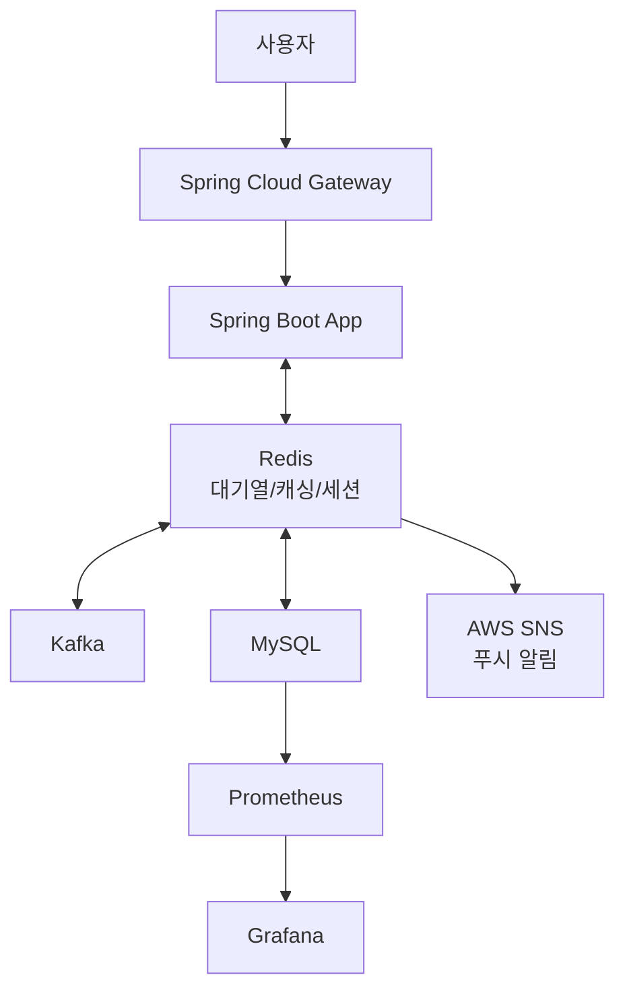

# 티켓 예매 시스템

_대규모 트래픽을 처리하는 티켓 예매 시스템_

## 프로젝트 개요

이 프로젝트는 대규모 트래픽을 처리하는 티켓 예매 시스템으로, 높은 TPS(Transactions Per Second)와 안정성을 목표로 설계되었습니다. 대기열 기능, 실시간 상태 업데이트, 알림 서비스를 지원하며, 토스, 당근, 배민의 기술 요구사항에 부합하는 기술 스택을 사용합니다. 특히, 알림 서비스는 사용자가 대기열에 머무르지 않고 백그라운드로 전환하더라도 예매 가능 시점에 푸시 알림을 통해 재진입할 수 있도록 설계되었습니다.

---

## 기술 스택

- **언어 및 프레임워크**: Kotlin, Spring Boot
- **데이터베이스**: MySQL (티켓/사용자 데이터), Redis (대기열, 캐싱, 세션)
- **메시징**: Kafka (비동기 이벤트 처리)
- **알림**: AWS SNS (푸시 알림), 확장 가능(SMTP 이메일, SMS)
- **인프라**: AWS EC2, Kubernetes
- **모니터링**: Prometheus, Grafana, ELK Stack
- **CI/CD**: Jenkins, Git

---

## 주요 기능

### 1. 사용자 인증

- JWT 기반 인증
- Spring Security로 구현

### 2. 대기열 시스템

- Redis를 사용한 분산 락과 큐
- 사용자가 예매 요청 시 대기열에 추가, 순차 처리

### 3. 티켓 예매

- Kafka 토픽을 통해 예매 요청 비동기 처리
- MySQL에 예매 정보 저장

### 4. 알림 서비스

- 대기열에서 예매 가능 상태 도달 시 Kafka 이벤트 발행
- Spring Boot가 이벤트를 소비하여 AWS SNS로 푸시 알림 전송
- 알림 링크를 통해 사용자가 애플리케이션 재진입
- Redis로 사용자 디바이스 토큰 및 세션 정보 관리

### 5. 실시간 모니터링

- Prometheus로 TPS, latency, 알림 전송 성공률, 에러율 수집
- Grafana로 대시보드 시각화

---

## 시스템 아키텍처



---

## 구현 계획

1. **1-2주**: 환경 설정 (AWS, Kubernetes, MySQL, Kafka, AWS SNS)
2. **3-4주**: 사용자 인증 및 대기열 시스템 구현
3. **5-6주**: 티켓 예매 로직 및 Kafka 연동
4. **7-8주**: 알림 서비스 구현 (AWS SNS 연동, Kafka 이벤트 소비, Redis 디바이스 토큰 관리)
5. **9-10주**: 모니터링 설정 (알림 전송 성공률 추가) 및 성능 테스트
6. **11-12주**: API 문서화, 코드 리팩토링, 최종 배포

---

## 성능 목표

- **TPS**: 1,000 이상
- **대기열 처리 시간**: 99% 요청 1초 이내
- **알림 전송 시간**: 95% 알림 2초 이내 전송
- **가용성**: 99.9% 이상

---

## 테스트 계획

- **단위 테스트**: JUnit으로 API, 비즈니스 로직, 알림 전송 로직 테스트
- **부하 테스트**: JMeter로 TPS, 대기열, 알림 전송 성능 측정
- **모니터링 테스트**: Prometheus 메트릭(알림 성공률 포함) 수집 확인

---

## 로컬 개발 환경 설정

### 필수 사전 요구사항

- Docker 및 Docker Compose 설치
- JDK 21 설치
- Kotlin 1.9.25 이상

### 환경 설정 단계

1. 저장소 클론

```bash
git clone https://github.com/your-username/ticket-system.git
cd ticket-system
```

2. Docker Compose로 인프라 실행

```bash
docker-compose up -d
```

이 명령은 다음 서비스를 설정합니다:

- MySQL (3306 포트)
- Redis (6379 포트)
- Kafka (9092, 9093 포트)
- Kafka UI (8080 포트)
- Prometheus (9090 포트)
- Grafana (3000 포트)
- Localstack (AWS 서비스 에뮬레이션, 4566 포트)

3. 애플리케이션 실행

```bash
./gradlew bootRun
```

4. 서비스 접속

- 애플리케이션: http://localhost:8082
- Kafka UI: http://localhost:8080
- Prometheus: http://localhost:9090
- Grafana: http://localhost:3000 (사용자명/비밀번호: admin/admin)

### Kafka 토픽 생성 (선택사항)

```bash
docker exec -it ticket-kafka kafka-topics --bootstrap-server localhost:9092 --create --topic ticket-events --partitions 3 --replication-factor 1
docker exec -it ticket-kafka kafka-topics --bootstrap-server localhost:9092 --create --topic notification-events --partitions 3 --replication-factor 1
```

### AWS SNS 로컬 설정 (Localstack 사용)

```bash
# AWS CLI 프로필 설정
aws configure --profile localstack
# 엔드포인트 지정 및 SNS 토픽 생성
aws --endpoint-url=http://localhost:4566 --profile localstack sns create-topic --name ticket-notifications
```
